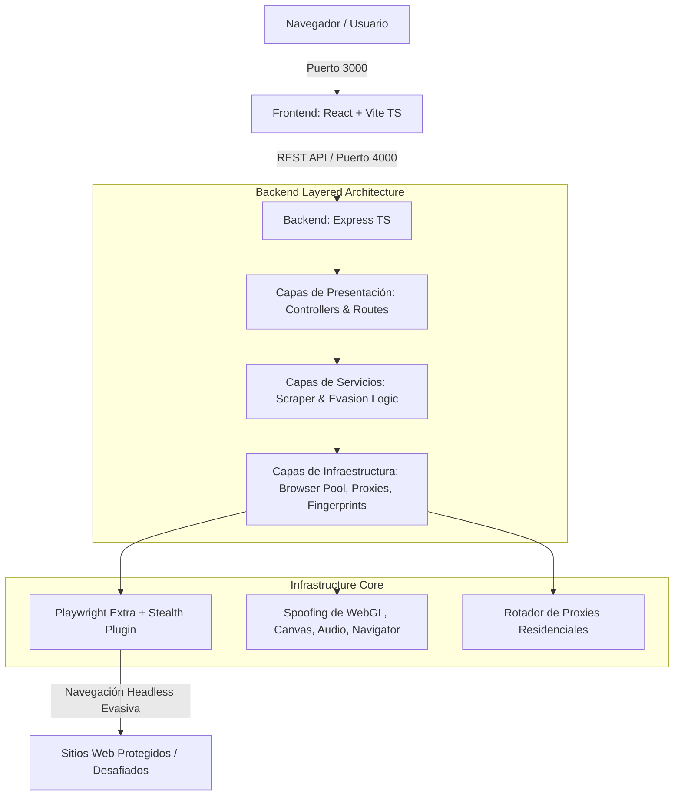

# 🛡️ Stealth Scraper Monorepo Architecture

Arquitectura monorepo completa de grado de producción para web scraping automatizado con evasión avanzada de sistemas antibot (**Cloudflare Turnstile, Datadome, Akamai, PerimeterX**).

---

## 🏗️ Arquitectura del Sistema



---

## 📁 Estructura del Monorepo

```
stealth-scraper-monorepo/
├── docker-compose.yml              # Orquestación de Frontend (3000) y Backend (4000)
├── package.json                    # Monorepo con Workspaces npm
├── .gitignore
├── .dockerignore
├── README.md
├── apps/
│   ├── backend/                    # Node.js + Express + TypeScript (Layered Architecture)
│   │   ├── Dockerfile              # Optimizado con dependencias de Chromium / Playwright
│   │   ├── package.json
│   │   ├── tsconfig.json
│   │   └── src/
│   │       ├── domain/             # Tipos e interfaces de dominio
│   │       ├── infrastructure/     # Playwright Stealth Factory, Browser Pool, Proxies, Fingerprints
│   │       ├── services/           # Lógica de scraping y emulación humana (EvasionService)
│   │       ├── presentation/       # Controladores Express, Rutas, Middlewares
│   │       └── index.ts            # Entrypoint del servidor
│   │
│   └── frontend/                   # React + Vite + TypeScript (Horizontal Modular)
│       ├── Dockerfile              # Contenedor Node dev/prod
│       ├── package.json
│       ├── vite.config.ts
│       ├── tsconfig.json
│       └── src/
│           ├── modules/
│           │   ├── dashboard/      # Telemetría en tiempo real, tasas de bypass, métricas
│           │   └── scrapers/       # Consola de ejecución y visualizador de payloads/snapshots
│           ├── shared/             # Componentes base, hooks y utilidades compartidas
│           ├── App.tsx
│           └── main.tsx
```

---

## 🚀 Puesta en Marcha Rápida

### Opción 1: Con Docker Compose (Recomendado)

Levanta todo el ecosistema (Frontend + Backend + Navegadores Playwright) en un solo comando:

```bash
docker compose up --build
```

- **Frontend Console:** [http://localhost:3000](http://localhost:3000)
- **Backend API & Telemetry:** [http://localhost:4000/api/v1/health](http://localhost:4000/api/v1/health)

---

### Opción 2: Ejecución Local

1. **Instalar dependencias:**
   ```bash
   npm install
   ```

2. **Instalar binarios de Playwright en el backend:**
   ```bash
   npx --workspace=@stealth-scraper/backend playwright install chromium
   ```

3. **Ejecutar ambos entornos en desarrollo:**
   ```bash
   npm run dev
   ```

---

## 🛡️ Técnicas de Evasión Integradas

1. **Inyección en Tiempo de Inicialización (`addInitScript`)**:
   - Ocultamiento de `navigator.webdriver`.
   - Mock de `window.chrome` y plugins de navegador reales.
   - Enmascaramiento de `hardwareConcurrency`, `deviceMemory` y `platform`.
2. **Generación Coherente de Huellas Digitales (`FingerprintGenerator`)**:
   - Rotación sincronizada de User-Agent con Client Hints (`Sec-Ch-Ua`, `Sec-Ch-Ua-Platform`).
   - Mock de WebGL Vendor/Renderer (NVIDIA, AMD, Apple M-series).
3. **Comportamiento Humano Emulado (`EvasionService`)**:
   - Curvas de movimiento de ratón naturales con jitter y aceleración.
   - Desplazamiento (scrolling) por inercia aleatoria.
   - Variabilidad temporal en pausas y tiempos de reacción (Human Delay).
4. **Gestión de Recursos y Aislamiento (`BrowserPool`)**:
   - Reutilización inteligente de instancias y aislamiento estricto de contextos (`BrowserContext`) para evitar la fuga de cookies y huellas de sesión.
   - Rotación y control de salud de proxies residenciales.
